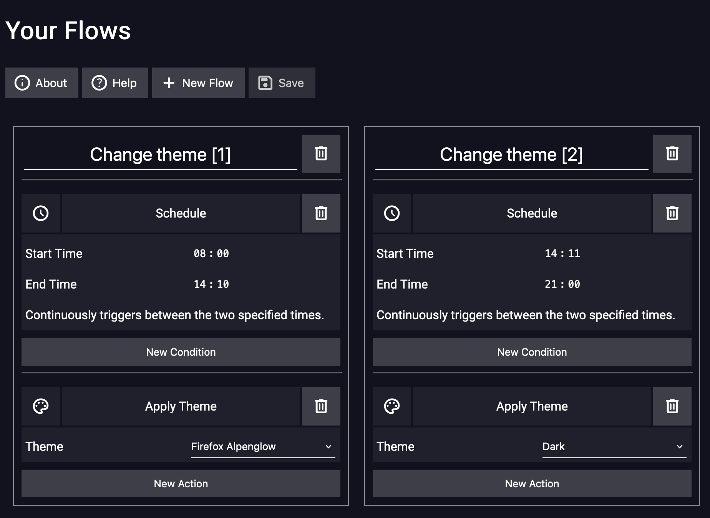
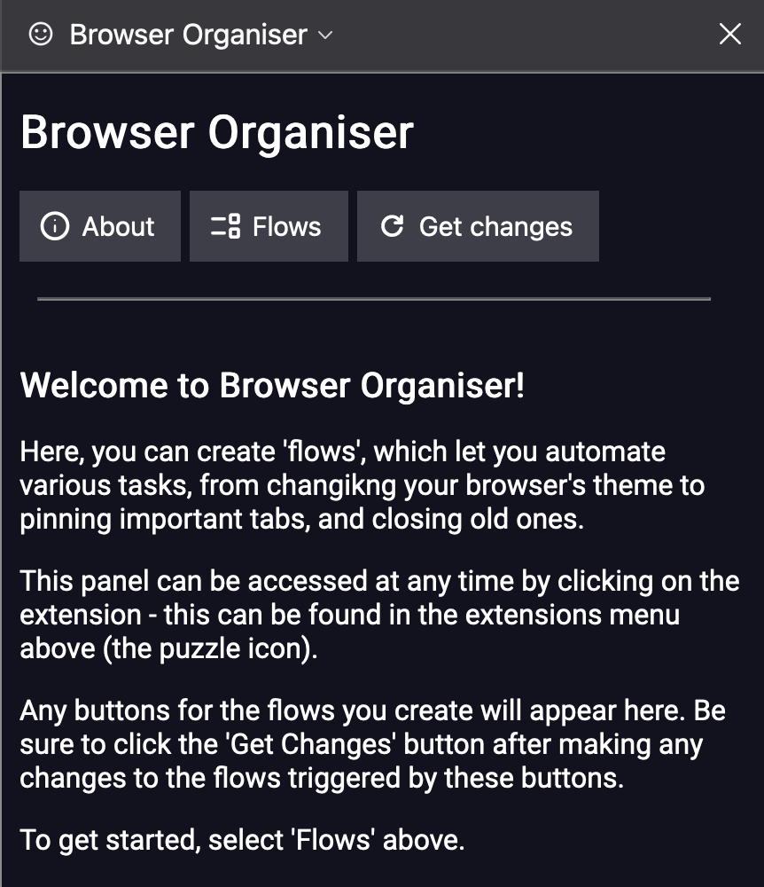
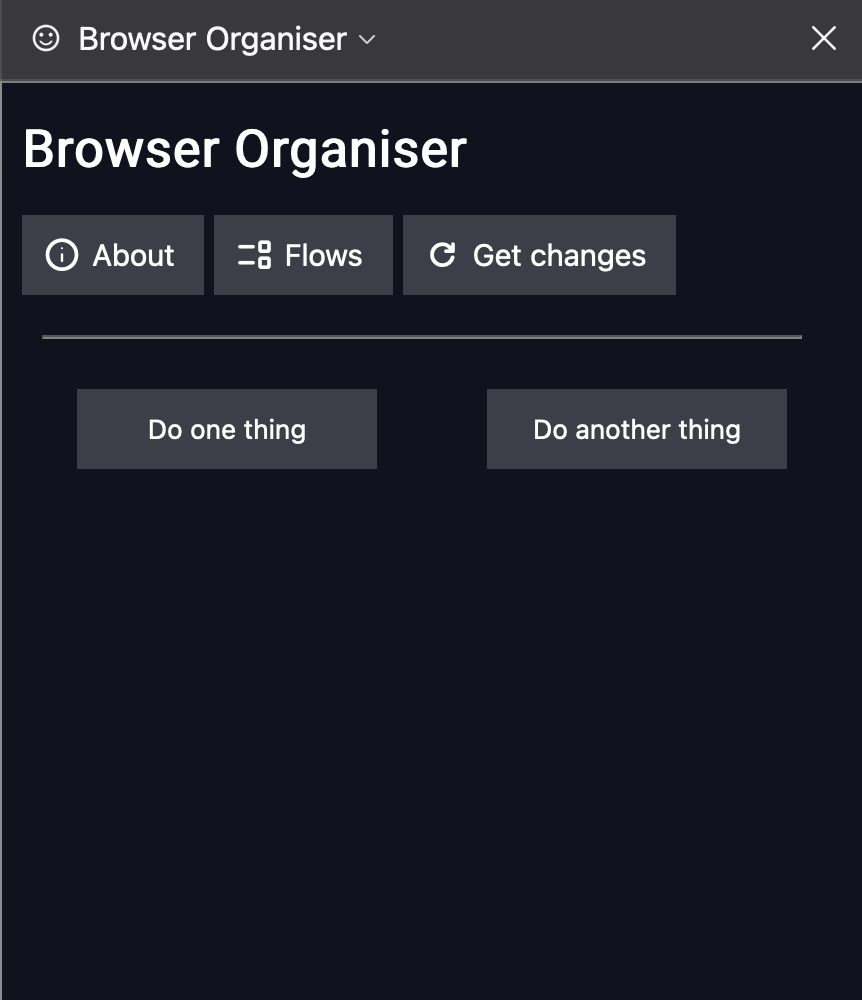
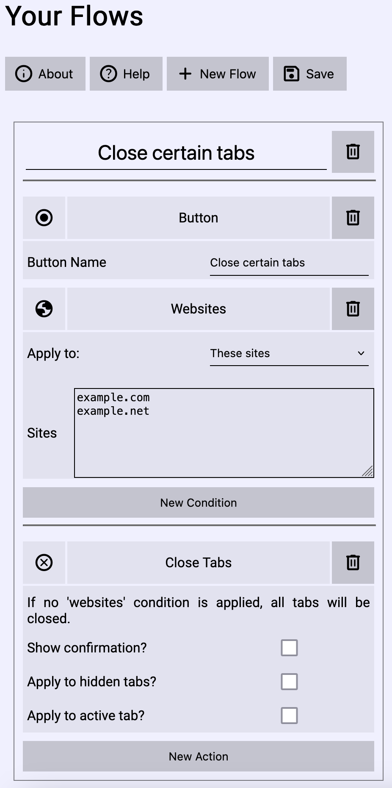
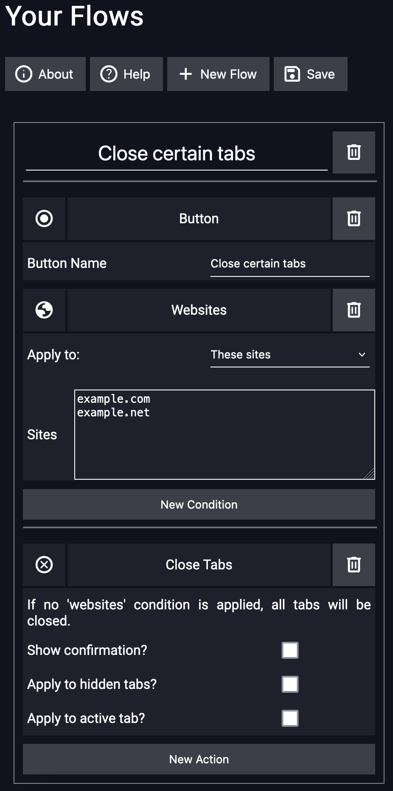
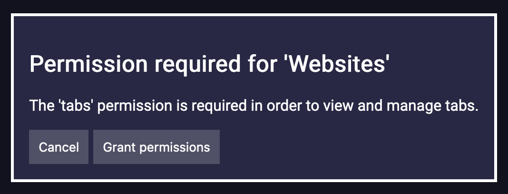
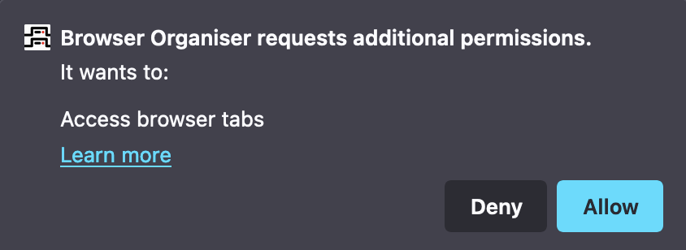

Browser organiser is a firefox extension that allows you to automate tasks, from changing the theme at certain times of day, to avoiding tab clutter, to pinning important ones.

## Easy to use
With Browser Organiser, no code is necessary: simply select what to do and when, and click save.

## Convenient sidebar

Browser Organiser has a convenient sidebar, where you can add custom buttons to run your flows.

## Light and dark mode

Browser Organiser has support for both light and dark mode.

## Secure

Browser Organiser only requests the permissions it absolutely needs, when it needs them.

## ... And more!

You can view the [source code on GitHub!](https://github.com/Jaffa42/Browser-Organiser)